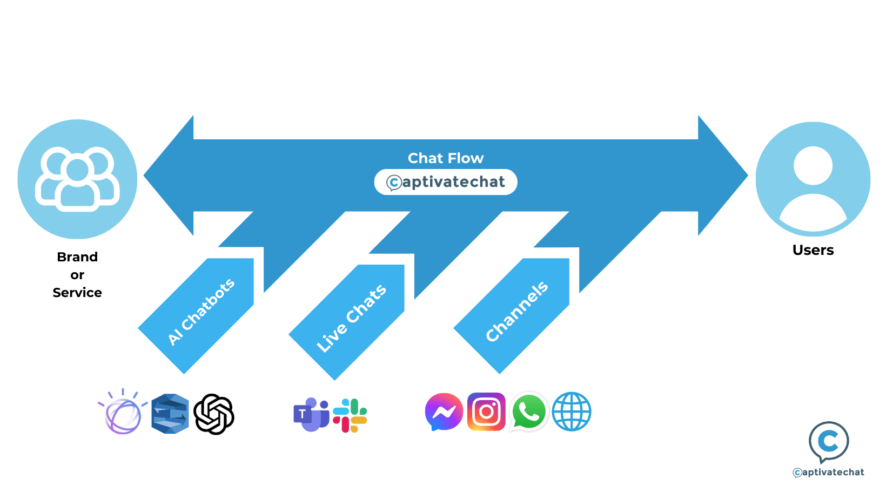
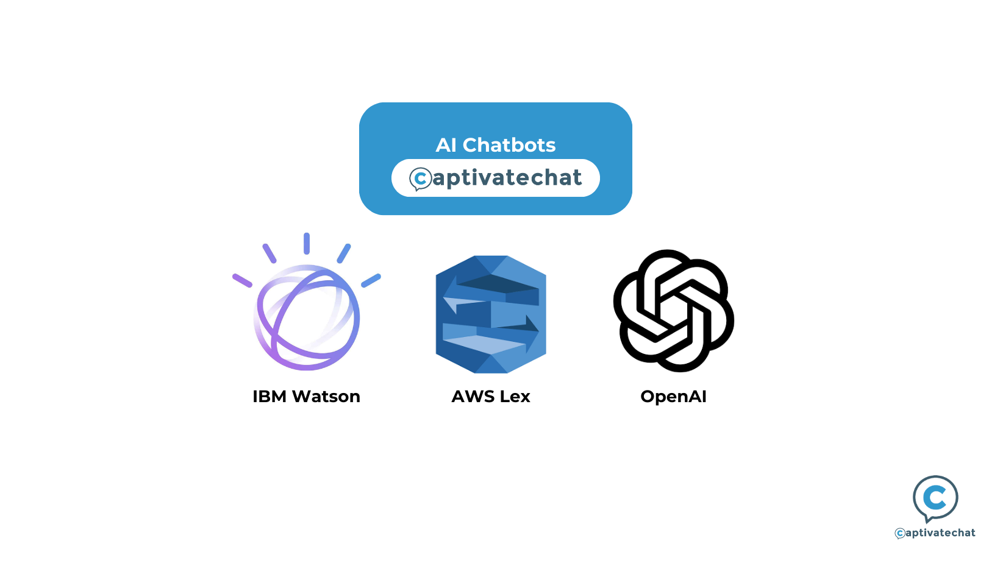
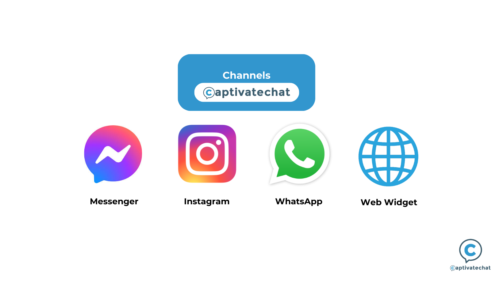
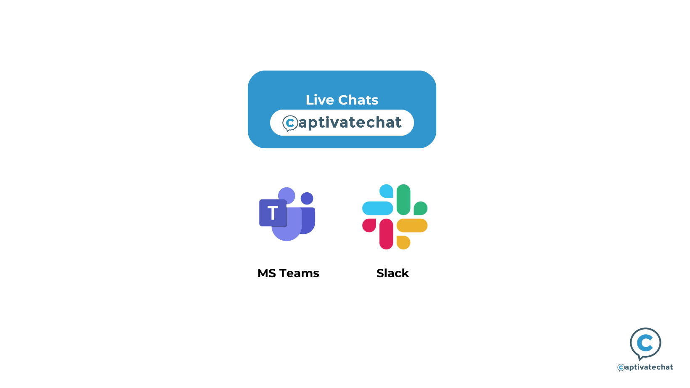

# 💻 Components

Connecting your business to the **Chat Flow** provides a way to integrate your live chats, chatbot programs, and external channels into a single interface.&#x20;

With the Chat Flow, you can easily manage all your bots for your channels without creating new ones. Here’s how each component of our Flow works together:

***

## The Chat Flow

<figure><figcaption>
The Chat Flow allows Brands to connect to Users by seamlessly integrating AI Chatbots with Live Chat services and brand Channels.
</figcaption></figure>

The **Chat Flow** is the core of Captivate Chat. It seamlessly brings together AI Chatbots, Channels, and Live Chat into one cohesive system.

When you create a Chat Flow with Captivate, it manages all necessary integrations—ensuring that all human-machine conversations across its connections are compatible and interchangeable.


**The Chat Flow**

In the platform, you can create different **Chat Flows** that connect these components in ways that work for your business!


***

## AI Chatbots

<figure><figcaption>
Captivate Chat uses AI Chatbots powered by IBM Watson, AWS Lex, and OpenAI. 
</figcaption></figure>

An **AI Chatbot** is a computer program designed to simulate human conversations through text or voice interactions. Utilizing predefined scripts and natural language processing (NLP), AI Chatbots can understand and respond to user inputs.

Within Captivate Chat, you can integrate your existing AI Chatbots or create new ones. Our platform supports the following AI Chatbot infrastructures:

* **IBM Watson Assistant**: Developed by IBM, this advanced Chatbot infrastructure is renowned for its flexibility and compatibility across various services and industries.
* **AWS Lex**: Created by Amazon Web Services (AWS), AWS Lex is ideal for users within the Amazon ecosystem or the e-commerce sector.
* **OpenAI**: Developed by OpenAI, this platform offers a suite of tools and APIs to help developers build and scale AI-powered applications.
* **Custom Chatbot:** We can create a personalized LLM to fulfill your specific objectives.

***

## Channel

<figure><figcaption>
Captivate Chat can integrate AI Chatbots into Channels such as Messenger, Instagram, WhatsApp, and Web Widgets.
</figcaption></figure>

A **Channel** is the platform or tool used by end users to access your AI Chatbot. They serve as the point(s) of engagement to your AI Chatbot.

Your Chat Flow gives users access to your AI Assistant across all of the Channels and Live Chat tools you enable. Among available Channels you can use with our platform are the following:&#x20;

* **Web Widget**
* **Messaging Services**
  * WhatsApp
* **Social Media**
  * Messenger (Facebook/Meta)
  * Instagram (Meta)
* **Custom Channel:** We can create a personalized Channel for your Captivate Flow, especially if you have a preferred deployment area outside web widgets and messaging services.

***

## Live Chats

<figure><figcaption>
Captivate Chat can work with Live Chat service providers such as MS Teams and Slack.
</figcaption></figure>

**Live Chats** enable real-time communication between agents and clients, facilitated by AI Chatbots. These systems ensure seamless interaction, with AI Chatbots handling routine inquiries and escalating complex issues to human agents.

Your Chat Flow is programmed to analyze incoming messages from various Channels, directing them to Chatbots for general responses and to Live Chat agents for specialized answers. Captivate Chat currently supports these Live Chat services:

* **Microsoft Teams**: A collaboration platform that integrates chat, video conferencing, and file sharing within the Microsoft 365 suite.&#x20;
* **Slack**: A messaging platform focused on team communication through organized channels. It integrates with numerous third-party apps, making it highly flexible and suitable for diverse workflows.
* **Custom Live Chat:** We can create a custom-tailored Live Chat for your team.&#x20;

