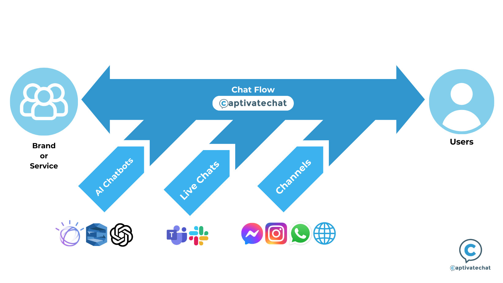
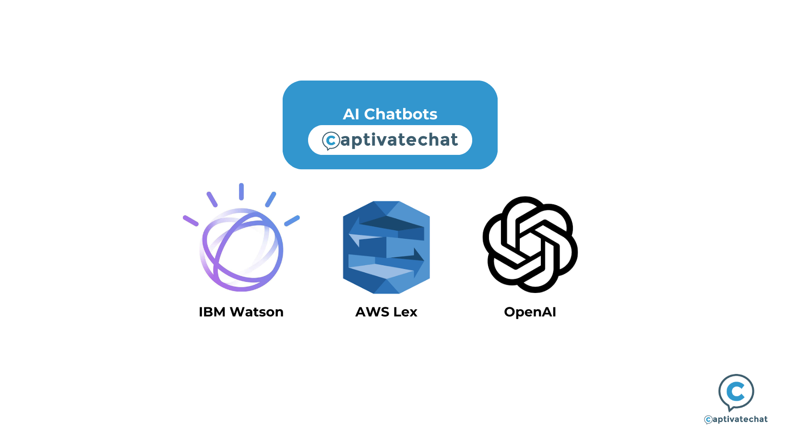
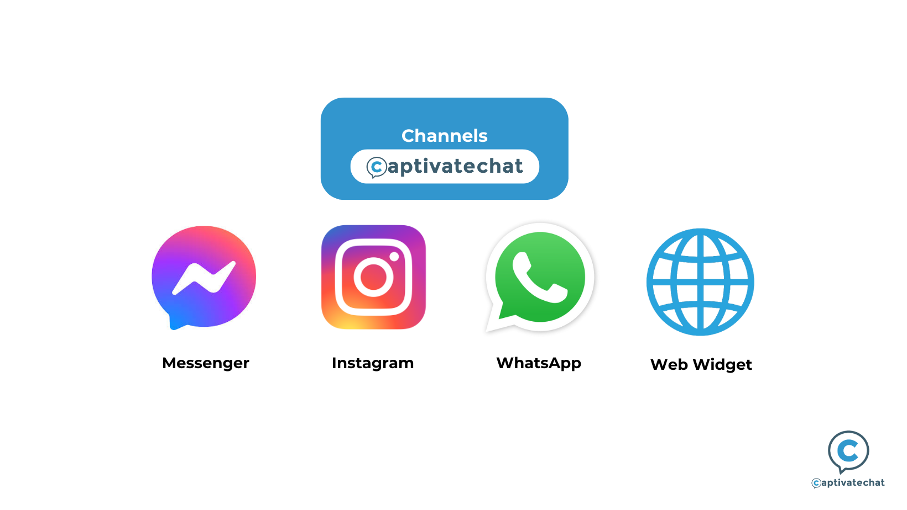
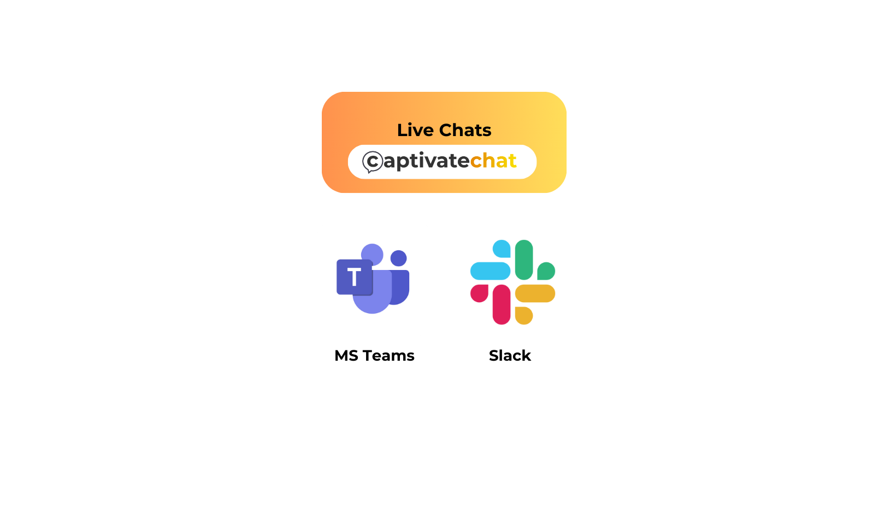

# 💻 Components

Connecting your business to the **Chat Flow** provides a way to integrate your live chats, chatbot programs, and external channels into a single interface.&#x20;

With the Chat Flow, you can easily manage all your bots for your channels without creating new ones. Here’s how each component of our Flow works together:

***

## The Chat Flow

<figure><figcaption>
Use Chat Flow to connect Users to Brands, Companies, and Services in a seamless fashion by facilitating integrations between their AI Chatbots, brand presence Channels, and Live Chat services.
</figcaption></figure>

The **Chat Flow** is the core of Captivate Chat. It seamlessly brings together AI Chatbots, Channels, and Live Chat into one cohesive system.

When you create a Chat Flow with Captivate, it manages all necessary integrations—ensuring that all human-machine conversations across its connections are compatible and interchangeable.


**The Chat Flow**

Use the Captivate Chat platform to create different **Chat Flows** that connect AI Chatbots, Channels, and Live Chats in ways that work for your business!


***

## AI Chatbots

<figure><figcaption>
Captivate Chat uses AI Chatbots powered by IBM Watson, AWS Lex, and OpenAI. 
</figcaption></figure>

An **AI Chatbot** is a computer program designed to simulate human conversations through text or voice interactions. Utilizing instructions from prompts and natural language processing (NLP), AI Chatbots can understand and respond to user inputs.

Within Captivate Chat, you can integrate your existing AI Chatbots or create new ones. Our platform supports the following AI Chatbot infrastructures:

* **IBM Watson Assistant**: Developed by IBM, this advanced Chatbot infrastructure is renowned for its flexibility and compatibility across various services and industries.
* **AWS Lex**: Created by Amazon Web Services (AWS), AWS Lex is ideal for users within the Amazon ecosystem or the e-commerce sector.
* **OpenAI**: Developed by OpenAI, this platform offers a suite of tools and APIs to help developers build and scale AI-powered applications.
* **Custom Chatbot:** We can create a personalized LLM to fulfill your specific objectives.

***

## Channel

<figure><figcaption>
Captivate Chat can integrate AI Chatbots into Channels such as Messenger, Instagram, WhatsApp, and Web Widgets.
</figcaption></figure>

A **Channel** is basically the platform that your users access to get information about your company and avail your services. Using a Chat Flow, you can deploy your AI Chatbot in these Channels to assist users about their concerns.

Among available Channels you can use with our platform are the following:&#x20;

* **Web Widget**
* **Messaging Services**
  * WhatsApp
* **Social Media**
  * Messenger (Facebook/Meta)
  * Instagram (Meta)
* **Custom Channel:** Our team at Captivate Chat can create a personalized Channel, especially if you have a preferred deployment area outside web widgets and messaging services.

***

## Live Chats

<figure><figcaption>
Captivate Chat can work with Live Chat service providers such as MS Teams and Slack.
</figcaption></figure>

**Live Chats** pertain to messaging platforms with special app integration features. Thanks to Chat Flows, we can use Live Chats to provide real-time contact between your agents and the users that your AI Chatbots are conversing with. Captivate Chat ensures seamless interactions between users and agents, with AI Chatbots handling general questions and escalating complex issues to human agents.

Your Chat Flow is programmed to analyze incoming messages from various Channels, directing them to Chatbots for general responses and to Live Chat agents for specialized answers. Captivate Chat currently supports these Live Chat services:

* **Microsoft Teams**: A collaboration platform that integrates chat, video conferencing, and file sharing within the Microsoft 365 suite.&#x20;
* **Slack**: A messaging platform focused on team communication through organized channels. It integrates with numerous third-party apps, making it highly flexible and suitable for diverse workflows.
* **Custom Live Chat:** The Captivate Chat team can create a custom-tailored Live Chat for your team.&#x20;

