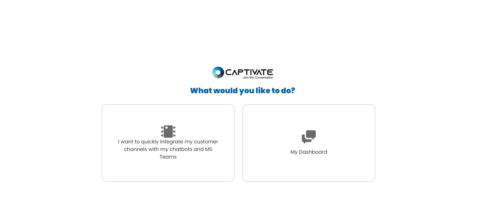

# 🚀 Get Started

Thank you for installing The Captivate Hub on your MS Teams. to start using the application register at [https://hub.captivat.io ](https://hub.captivat.io)first and create your hub.

To create new hub, login your Captivate Hub account and select the **"I want to quickly integrate my customer channels with my chatbots and MS Teams"** (Figure 1.0)

