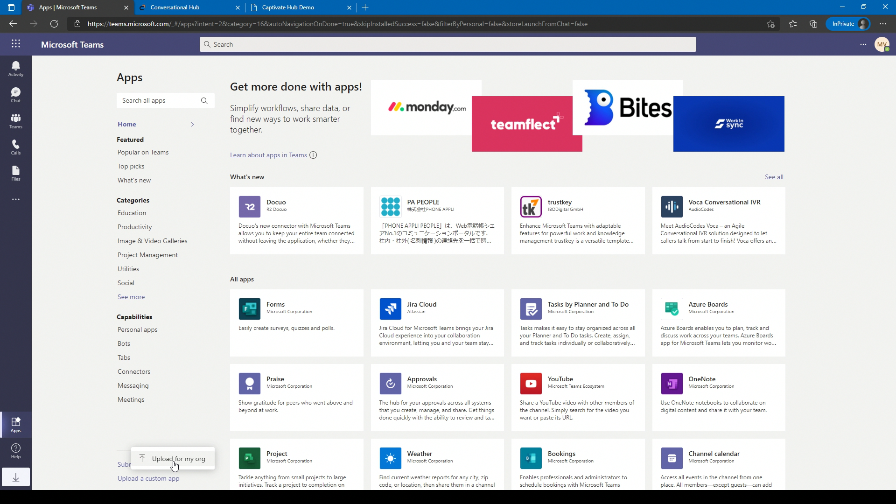
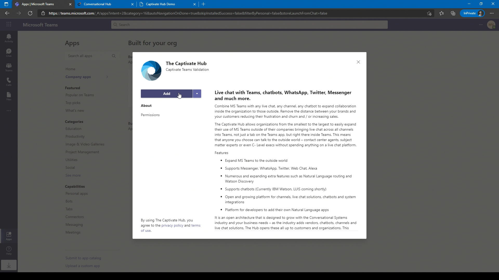
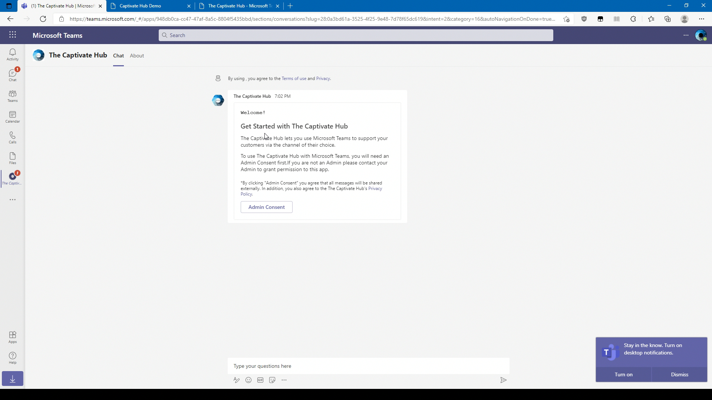
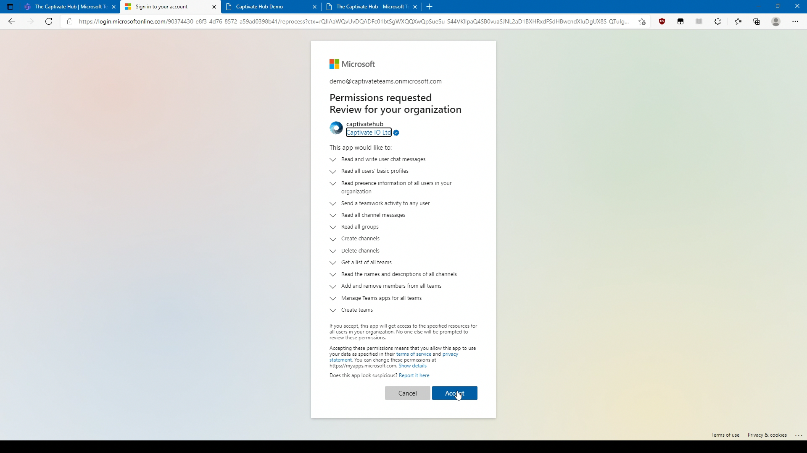
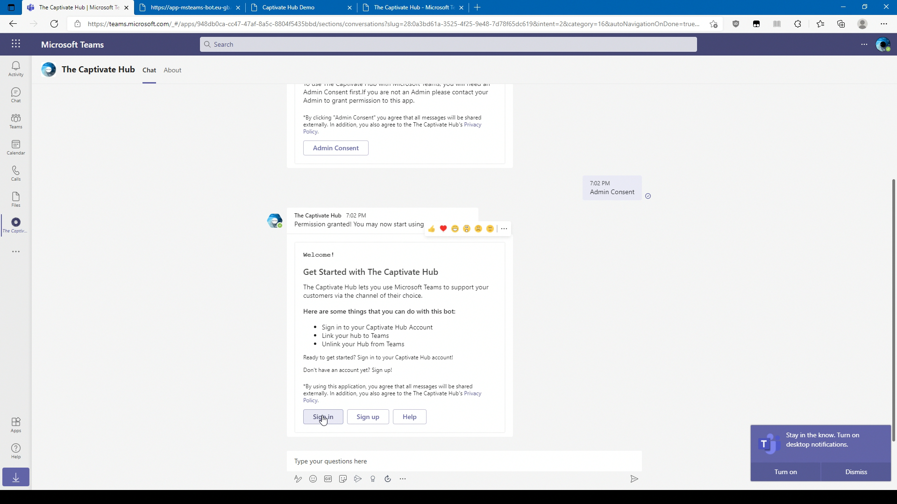
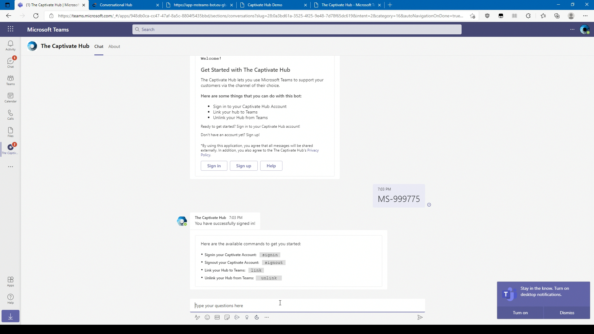
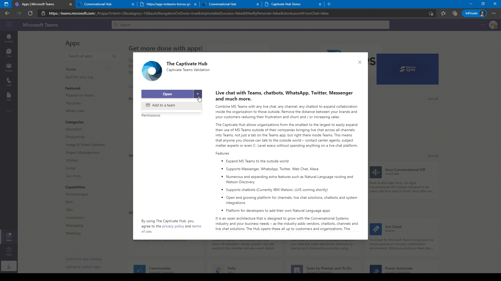
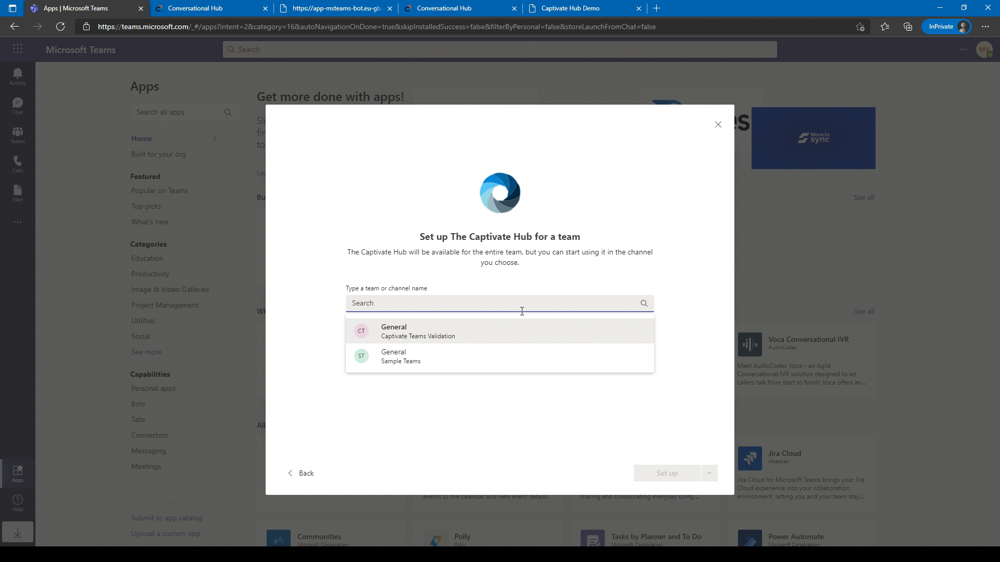
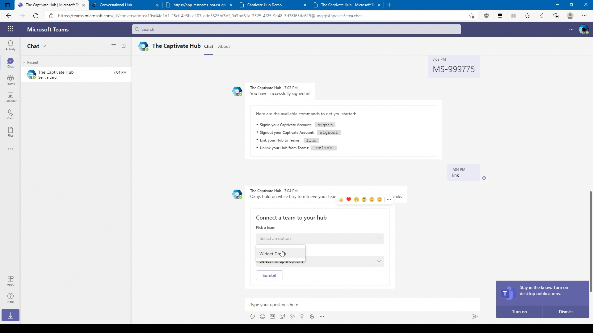
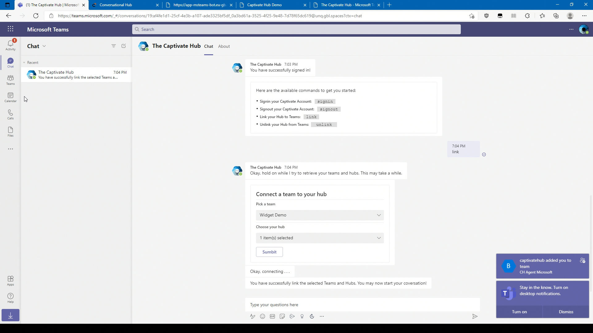

# Microsoft Teams


This documentation is not working anymore. please click the button below for the new documentation on Microsoft Teams



New Microsoft Teams documentation


### Permissions

The Captivate Hub Teams Apps requires **Global Administrator** permission to install since it needs these  to work:

1. **Read user’s presence information permission** or _Presence.Read.All_ permission is a Microsoft Delegated permission, allows the app to check presences/availability for each member (eg. ‘Available’, ‘Busy’, ‘Be right back’). The sole user of this permission is the presence bot which enables the app to automatically assign conversations to available team members/agents.
2. **Create Teams permission** or _Team.Create_ permission is a Microsoft Application permission that allows the app to programmatically create teams for the team members in a team connected to a hub.
3. **Manage Teams Apps for All Teams permission** or _TeamsAppInstallation.ReadWriteForTeam.All_ is a Microsoft Application permission that uses the least privilege in app installation permissions and it’s job is to add The Captivate Hub app for a team, or to check if the app is installed. As we create the teams for the agents, we also need to add the Captivate Hub app programmatically to these teams.
4. **Add and Remove Members from all Teams permission** or _TeamMember.ReadWrite.All_ is a Microsoft Application Permission and is the only permission related to team members which allows The Captivate Hub app to add a member to a team that is also (and must be) a member of the team connected to a hub. As we create the teams for the agents, we also need to add them programmatically to these teams.
5. **Get a List of all Teams permission** or _Team.ReadBasic.All_ is a Microsoft Application Permission which allows the app to get the teams that a specific user has joined. We need this permission to check which teams  the user/agent is a part of to verify that the team has been created for the user/agent programmatically.
6. **Read all groups membership permission** or _GroupMember.Read.All_ is a Microsoft Application Permission, which is unlike Team.ReadBasic.All which reads only a specific user’s joined teams. This permission allows the app to list teams where The Captivate Hub app is installed during the link hub – team process.
7. **Read channel messsage** or _ChannelMessage.Read.All_ is a Microsoft Application Permission, whose API supports subscribing to changes (create, update, and delete) using change notifications. This allows callers to subscribe and get changes in real time. For details, see Get notifications for messages.
8. **Create / Delete Channels permission** or _Channel.Create_ and _Channel.Delete.All_ permissions respectively, is the most specific and lowest privilege permission related to creating and deleting channel. We create channels for new conversations and delete them once the chat sessions become stale for a set period.
9. **Sign in and Read user profiles permission** is a default given permission which allows the app to read only the basic information of user signed in (e.g name, email, id, jobtitle) primarily for the admin consent sign in/authentication.

### App Installation

* Download the manifest file below.
* Open your Microsoft Teams, select _Apps_. and click Upload a custom app -> Upload for my org and select the Manifest file.&#x20;

* Select the Captivate Hub and click _Add_&#x20;

### Authentication

* &#x20;You will be redirected to The Captivate Hub application. Read the adaptive card and click _Admin Consent_

* A new window will pop-up which will request permission to your tenant. Press _Accept_.

* &#x20;Close the window and go back to the Captivate Hub application. Click _Sign in_ to sign in to The Hub and you will be redirected to a webpage. Login to your account and it will display an authentication key. Paste the authentication key back to the Captivate Hub Teams.

.png>)

### Hub Installation

* Now that you are logged in to The Hub, create a new Team giving it a name you will associate with using The Hub (e.g. The Hub Live Chat). The Team can be Private, Public or Org-wide. Go back to Apps and select the "The Captivate Hub". Click on he dropdown next to Open and click add to aTeam. Select the new created team and press Set up a bot.

* &#x20;Go back to the Captivate Hub Chat and type _link_ to connect your hubs to this Microsoft Teams. Pick a Team and Choose you hub and press _Submit_. If the Captivate Hub replies, "You have successfully linked the selected Teams and Hubs. You may now start your conversation!" it means The Hub is now installed to your Teams.

###

### Auto-assign feature

For auto-assign feature, please add `presencebot@captivat.io` as a guest ([Add Guest Account to Microsoft Teams](https://support.microsoft.com/en-us/office/add-guests-to-a-team-in-teams-fccb4fa6-f864-4508-bdde-256e7384a14f)) to the created teams group and email us at support@captivat.io to manually accept your invitation.

### Commands

* Signin to your Captivate Account: signin‏‏‎&#x20;
* Signout of your Captivate Account: signout‏‏‎&#x20;
* Link your Hub to Teams: link‏‏‎&#x20;
* Unlink your Hub from Teams: ‎unlink ‏‏‎ ‎

### Agent Commands

These command are used by mentioning the bot e.g. **@The Captivate Hub** /endsession

* End livechat session: /endSession or /es
* Send action to bot: /sendAction or /run

\*Note: agent commands must be run on the channel created by The Captivate Hub
