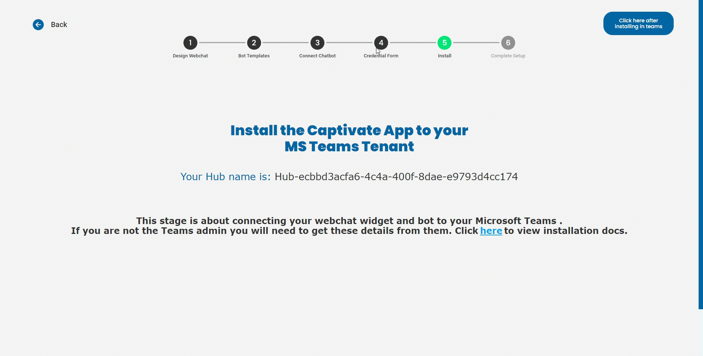
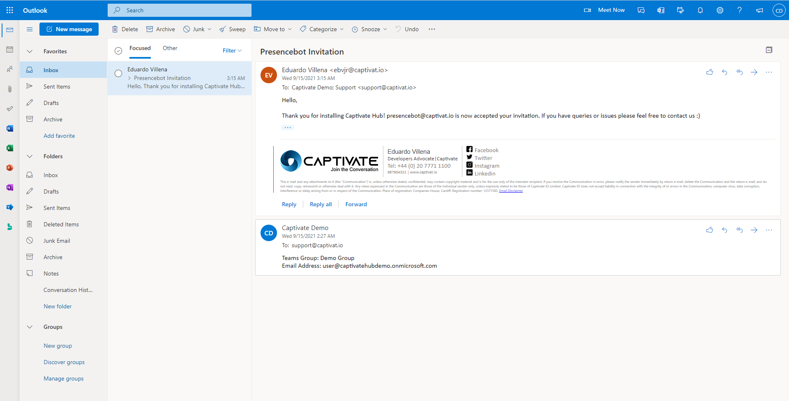

# Microsoft Teams

## Please follow all the instructions thoroughly and do not skip any instructions on the Installation part.

If you have any suggestions on this page, please email us at support@captivat.io


The Captivate Hub Teams Apps requires [**Global Administrator**](https://docs.microsoft.com/en-us/azure/active-directory/roles/permissions-reference#global-administrator) permission to install and it will not work on Personal versions (https://teams.live.com).





If you are on the last step of the creation of the Hub (Figure 1.0), please follow the instruction below and do not close the page. If you haven't yet set up your Hub, please go to [Get Started](../../../get-started.md). If it's easier there's a corresponding step by step video per instruction.


### App Installation.

* Open your Microsoft Teams, select **Apps** on the bottom left of your Microsoft Teams. On the Apps window search for "The Captivate Hub" and click the teams application. after clicking the teams application it will display a pop-up to add the teams application. click Add and you will be redirect to chat. (Figure 1.2)


Figure 1.2 - Installing The Captivate Hub on Teams Store


### Authentication

* &#x20;You will be redirected to The Captivate Hub application. Read the adaptive card and click **Admin Consent.**  A new window will pop up which will request permission to your tenant. Press **Accept.**  After you see the "**Permission granted! You may now use the The Captivate Hub Application.**" message, close the window and go to the next step. (Figure 1.3 / Video)


Figure 1.3 - Captivate Hub asking for Administrator Consent


* Go back to The Captivate Hub application. Click **Sign in** to sign in to The Hub and you will be redirected to a webpage. Login to your account and it will display an authentication key. **Paste the authentication key** back to the Captivate Hub Teams. (Figure 1.4 / Video)


Figure 1.4 - Sign in to the Captivate Hub thru Microsoft Teams


### Hub Installation

* Now that you are logged in to The Hub, [**create a new Teams group**](https://docs.microsoft.com/en-us/microsoftteams/get-started-with-teams-create-your-first-teams-and-channels#create-a-team) giving it a name you will associate with using The Hub (e.g. The Hub Live Chat). The Teams group can be Public or Private. Go back to Apps and select the "The Captivate Hub"**. Click on the dropdown next to Open** and **click add to a Team**. Select the newly created team and **press Set up a bot**. (Figure 1.5 / Video)


Figure 1.5 - Creating Teams groups and adding The Captivate Hub to the Teams group.


* &#x20;Go back to the Captivate Hub Teams chat and type **link** to connect your hubs to this Microsoft Teams. Select the Hub and the Teams and press **Submit**. If the Captivate Hub replies, "You have successfully linked the selected Teams and Hubs. You may now start your conversation!" it means The Hub is now installed to your Teams. (Figure 1.6 / Video)


Figure 1.6 - Linking the Hub on Microsoft Teams


### Presencebot (THIS IS AN IMPORTANT PART DO NOT SKIP THIS!)


If`presencebot@captivat.io` is not added to your Teams group **the Teams installation will not work!**


For auto-assign feature, please add `presencebot@captivat.io` as a guest ([Add Guest Account to Microsoft Teams](https://support.microsoft.com/en-us/office/add-guests-to-a-team-in-teams-fccb4fa6-f864-4508-bdde-256e7384a14f)) (Figure 1.7 / Video) to the created Teams group and **email us at support@captivat.io** to manually accept your invitation. (Figure 1.8 / Image)


Figure 1.7 - Adding presencebot@captivat.io to the Teams Group


### Adding Agents 


Adding an agent is not important part of installation. if you don't have any agents to add please skip this step and go to the Confirmation part of Installation.


* Adding an agent is achieved by simply adding them to the Teams group created on the Hub Installation part. To add Agents please add the agent as [member of the teams group](https://support.microsoft.com/en-us/office/add-members-to-a-team-in-teams-aff2249d-b456-4bc3-81e7-52327b6b38e9) (Figure 1.7 / Video)

### Confirmation

* Go back to your dashboard and click the hub, it will display "Widget Code" window. click **"View Widget"** (Figure 1.9/Image)

<figure><figcaption>
Figure 1.9 - Widget code modal
</figcaption></figure>

* Open the Web Widget on the new window and try to "Chat to Human". It will prompt that it will connect you to the support team. it will take time (a minute or less) on first connection since it scan members of the Teams group. It should be automatically assigned to a random online user to the Teams group. (Figure 1.10 / Video)


Figure 1.10 - Testing Widget and Microsoft Teams connection


Congratulations, you have now connected your Hub to Microsoft Teams!



### Commands

* Signin to your Captivate Account: signin‏‏‎&#x20;
* Signout of your Captivate Account: signout‏‏‎&#x20;
* Link your Hub to Teams: link‏‏‎&#x20;
* Unlink your Hub from Teams: ‎unlink ‏‏‎ ‎



### Agent Commands

These command are used by mentioning the bot e.g. **@The Captivate Hub** endsession

* End livechat session: endSesion
* Reassign to another agent: reassign

\*Note: agent commands must be run on the channel created by The Captivate Hub



