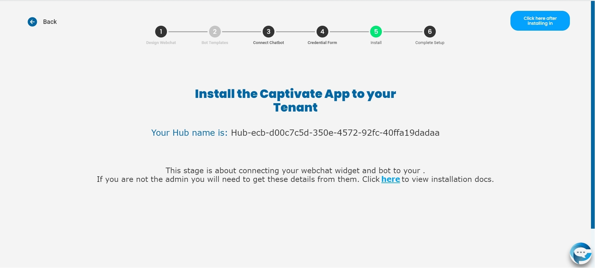

# Freshdesk

## Please follow all the instruction thoroughly and do not skip any instructions.

If you have any suggestions on this page please email us at support@captivat.io

## Choose your Livechat

* Select Freshdesk

.jpg>)

## Configure your Livechat

* To connect your Freshdesk to your Hubs please provide your correct account's Api Key and Freshchat URL. This will allow us to get your Freshdesk Groups.

.png>)

