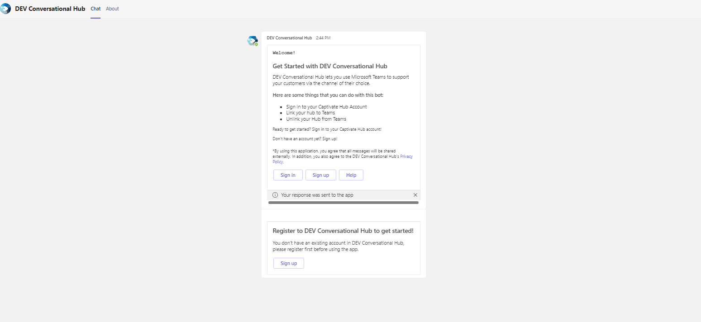

# Channel: Web Widget

After _**Select Channel > Web Widget**_, you will be taken to the **Configure Web Chat** view. This is where you will set up your Chatbot to make it compatible with your website.&#x20;

<figure><figcaption></figcaption></figure>

***

## Configure Web Chat

### Text Options

<figure><figcaption></figcaption></figure>

Customize the basic text that appears with your Chatbot once it becomes a Web Widget. This portion has the following components:

* **Title:** This is the "name" that users will see on the Chatbot.
* **Group Name:** This is the "public name of the Chatbot. You can name this after yourself, your team, or your company. In the image above, its name is _"Captivate Chat Bob."_&#x20;
* **Widget Text Description:** This is the invitational message your Chatbot reveals when users click it for the first time.&#x20;

### Color Options

<figure><figcaption></figcaption></figure>

Customize how your AI Chatbot appears in your website using a wide array of color options:

* **Primary Color**
* **Bubble Background** (User, Bot, Agent)
* **Chat Text** (User, Bot, Agent)
* **Chat Buttons** (Background, Text)


**Fit your Web Widget colors to your branding!**

Switch up your Web Widget colors to match your branding. Select the square icon beside the hexcodes to open a color palette where you can choose your preferred colors.&#x20;


### Image Options

<figure><figcaption></figcaption></figure>

Customize your Chatbot further with options that add "personality" to them. These include:

* **AI Assistant Avatar:** This is how your Chatbot appears in the Web Widget.
* **Widget Icon:** This is how your Chatbot appears as an icon before expanding into a chat box. It can be the same icon as your AI Assistant Avatar.&#x20;
* **AI Assistant Business Image:** This represents the icon or logo of your branding or business.&#x20;
* **AI Assistant Chat Header Image:** This is the unique background that comes with your AI Assistant Avatar.


**Use high-quality resources**

Since your Chatbot is an extension of your branding, it's important to use high-quality resources such as images for elements such as your AI Assistant Avatar and Business Image.


### Working Hours

<figure><figcaption></figcaption></figure>

Determine your Chatbot's working hours. You can choose its **Start Time** and **End Time**, and specific days of the week you want it to function. Here are your main considerations:

* **Disable Working Hours:** Toggling .png>) off means the Web Widget won't follow a schedule and **provide 24/7 coverage**. This is perfect if your Web Widget is designed solely to answer questions and not connect users with live agents.
*

If you want your Chatbot to connect users to Live Agents, try to set the Chatbot's schedule to match that of your team's for a more seamless experience.

### Embed Live Chat

<figure><figcaption></figcaption></figure>

After setting the above options, we'll create an **embed code** you can copy and paste into your website. Make sure it's pasted **before the closing \</body> tag** on pages of your website where you want the AI Assistant to show up.

***

## Preview your Web Widget

After creating your Web Widget, you can preview how it looks like right from the Captivate Chat platform!&#x20;

### Widget Code

<figure><figcaption></figcaption></figure>

After the **Embed Live Chat** of the _**Select Channel > Web Widget**_ process, clicking _**Next**_ will reveal the **Widget Code** in a separate window.&#x20;

You can either _**Close**_ it to make other changes, or you can _**View Widget**_ to "see" your Chatbot in action.&#x20;


**Give the Widget Code to your Web Administrator!**

If you want your web widget to appear on your live website, you must copy this Widget Code and give it to your Web Administrator.


### Widget Preview

<figure><figcaption></figcaption></figure>

When you click _**View Widget**_, your browser will open a new window that says **Captivate Chat - Widget Preview**.&#x20;

This is the place where you can check how your Web Widget looks like even before you plug in the code to your actual website.&#x20;

Notice how your Widget Icon is on the lower right of the screen.&#x20;

### Testing the Web Widget

<figure><figcaption></figcaption></figure>

Clicking your Widget Icon reveals a prototype of the Chatbot.&#x20;

This prototype is fully functional, with both your set visual settings and included AI training. You can ask it questions and see its responses. Thanks to this process, you can see all aspects of your Chatbot before it's even deployed to your system.&#x20;

### Customizing the Web Widget Preview

<figure><figcaption></figcaption></figure>

Clicking the **Green Circle (**  **)**on the upper right of the preview site will reveal more customization options. With this new window, you can:

* **Share URL:** Copy the URL of this Widget Preview so you can share it with your teammates.
* **API Key:** The API Key of the Web Widget.
* **Background:** You can customize the Background of this Widget Preview.&#x20;

### Background

<figure><figcaption></figcaption></figure>

Under **Select Background Type**, you can choose either a **Web** or **Image** as the source of your Background Asset:

* **Web:** You can enter any URL to "copy" its background. This reveals how the Web Widget can appear in a live website.
* **Image:** You can upload an image that becomes the background of the Web Widget. This is useful if you're still designing your website.&#x20;

<figure><figcaption></figcaption></figure>

Click .png>) once you're ready to apply the new background. This shows a static (non-moving) version of your source URL or image. You can still interact with your Web Widget prototype like in the first version of the preview. However, this time you can now see how your Web Widget looks like when placed in your website.


**Use the static preview to change the colors of your Web Widget!**

You can use the static preview as a "reference" on how your Web Widget looks like in action. Check whether your chosen Options (Text, Color, Image) fit your overall aesthetic and branding.&#x20;

Use this opportunity to make the appropriate changes before you implement this Web Widget in your live website.&#x20;


***

## You're all set!

Doing all the steps above should get your Chatbot ready to be used with a Web Widget.
