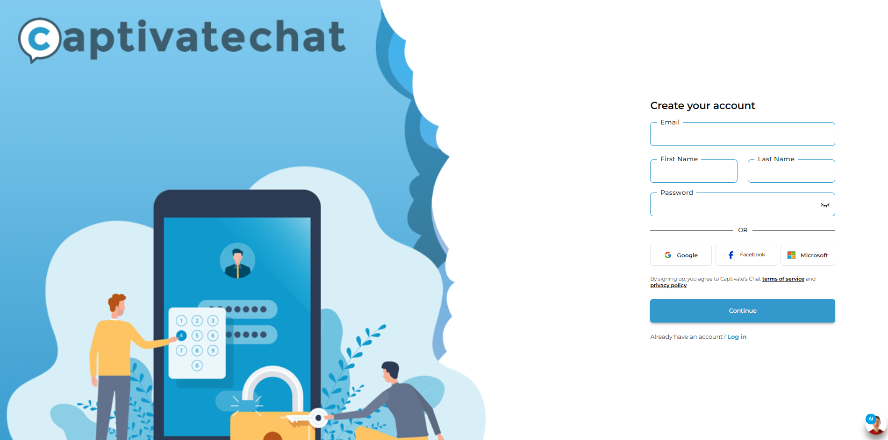

# Import Your Own Information

<figure><figcaption>
After giving your AI Chatbot a name and logo, you will be taken to "Import Your Own Information." This menu contains a list of resources you uploaded, and the option to upload new data.
</figcaption></figure>

It's in the _**Import Your Own Information**_ page where you will establish your AI Chatbot's knowledgebase by uploading data.&#x20;

Importing your own information or uploading your data is the most important step in AI Chatbot creation. This is what the bot uses to answer user questions.

Make sure the information you will include has everything you want the Chatbot to use as a reference. In-depth sources can provide more accurate and reliable responses from your new Chatbot.&#x20;


**The more the merrier!**

Think of this process as building the encyclopedia your Chatbot will rely on when answering customers. Since your Chatbot is an "intelligent" model, it knows how to combine information from different sources. This is where you come in. \
\
The more resources you provide, the more information your Chatbot can access when creating responses!


To start adding data to your chatbot, click   (1).png>)

### Adding files and URLs to import

<figure><figcaption>
Use the blue "Import" button to open the "Import" menu in order to add files and/or URLs to your Chatbot's database
</figcaption></figure>

An _**Import**_ pop-up window should appear. You can either:

* **Import:** Click or drag **PDF files** (up to 100MB) that contains important information that your Chatbot should know. You can drag multiple files at once by selecting a group of files and dragging them all to the file import area.
* **URL(s):** List a set of URLs (one URL per line) that will become the basis of the knowledge of your Chatbot.&#x20;

Once you have completed the files or webpages you want to import click on the  (1).png>)button.

<figure><figcaption>
After you upload your data and click the "Import" button in the "Import" menu, you will be taken to the "Proceed with Ingestion?" window. You will be given an estimated number of tokens required to ingest the data you just uploaded. Click "Import Selected" to proceed.
</figcaption></figure>

You will be asked to pay a number of tokens to ingest the URL or PDF you've just uploaded. Click .png>) to proceed.


**Import limit**

We limit the number of imports to support **a combination of up to 20 Files and URLs.**



**Only PDF files allowed**

We only support **PDF files** as of the moment. If you have data in some other format such as a **DOCX** (MS Word) or **PPTX** (MS Powerpoint) file, simply save those files as **PDFs** and import the PDF file.


### The import process

<figure><figcaption>
A list of recently-uploaded resources are not clickable as they are still being ingested by the AI Chatbot. This process will go to "Allocating resources" then "Ingesting" before a successful ingestion. 
</figcaption></figure>

After clicking the .png>) button, you will then see a list of the files or URL(s) being imported. Wait patiently as the information is ingested. Here are the status updates throughout the importation process:

<figure><figcaption>
The ingestion process of newly-uploaded data/resources starts with an "Allocating resources" message in "Import Your Own Information." This will take a few minutes.
</figcaption></figure>

<figure><figcaption>
After a few minutes of "Allocating resources" in "Import Your Own Information," the system will give a message that ingestion has been completed.
</figcaption></figure>

Please be patient. The time taken to import a PDF file or URL is dependent upon the size of the file or webpage.  You can return to import further information or remove information at any time. &#x20;


**Import again whenever you make updates!**

When you upload your resources to an AI Chatbot, they are only ingested **in their instance as of that moment.** This means the AI Chatbot doesn't auto-ingest your URL or PDF if you make any updates.

If you make any major changes to your resources, disable their original iteration and import the updated versions to your AI Chatbot.


### Restrict Data from Internet

<figure><figcaption>
A "Restrict Data from Internet" toggle is located in the "Import Your Own Information" page during AI Chatbot setup. Toggle this to "Active" to restrict AI Chatbots into just using the information it contains, and toggle this it "Inactive" to allow AI Chatbots to search the internet for information.
</figcaption></figure>

One additional feature is the ability to force your AI Chatbot to only use data it can gather from your resources instead of getting more insights from the internet. This can be done by toggling **Active/Inactive** at the right-hand side of the screen.&#x20;

The AI Chatbot will take note of this and behave as requested in most circumstances but like us humans may not be able to help itself sometimes. Adjust any prompts accordingly to maximize the functionality of this toggle.

Once your data has been imported, click .png>).

***

##
